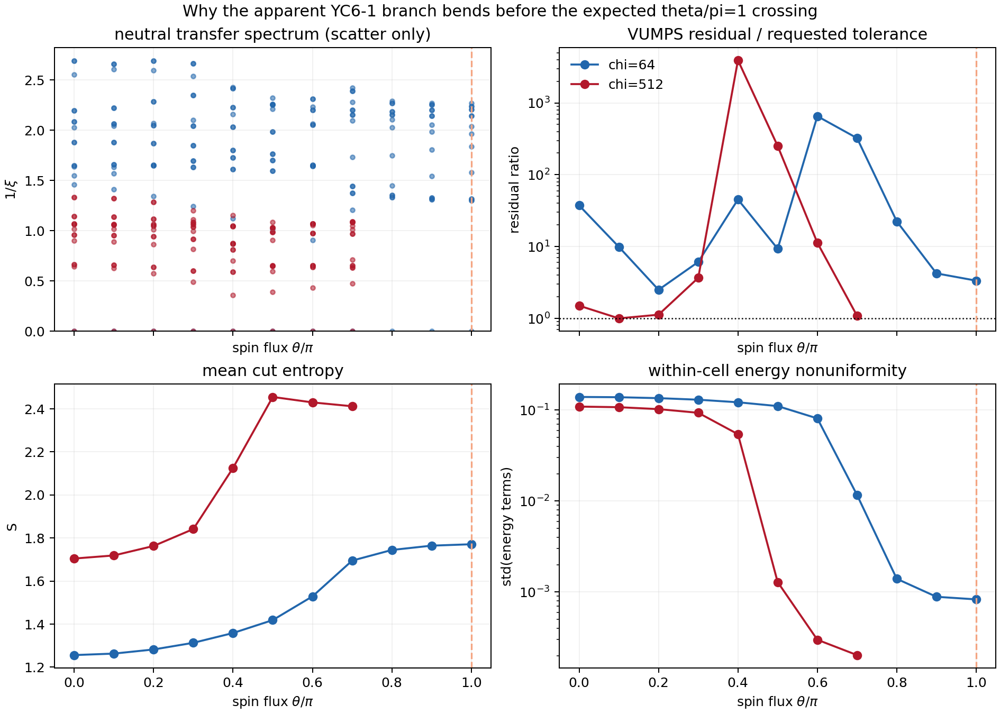

# Diagnosis of the legacy YC6-1 transfer-spectrum scan

## Verdict

The apparent low-lying feature near `theta/pi = 0.4` is not evidence for the Hu et al. Dirac crossing. It coincides with a failed VUMPS solve and a jump between variational basins. For YC6-1 the expected positive crossing is `theta/pi = 1`, which the chi=512 checkpoint never reached.

## Direct evidence

| check | chi=64 | chi=512 |
|---|---:|---:|
| completed flux points | 11 | 8 |
| largest completed `theta/pi` | 1.0 | 0.7 |
| requested residual tolerance | 1.0e-5 | 1.0e-5 |
| largest final residual/tolerance | 652.4084592876719 | 3920.756081409963 |
| physical `S^z=1` transfer sector present | false | false |
| MPS state retained in processed HDF5 | false | false |

At chi=512 and `theta/pi=0.4`, the residual reached only `5.489198e-03` at iteration `3` of `20` and ended at `3.920756e-02`, versus a target of `1.0e-05`. The final residual is therefore `3920.8` times the target.

Across `theta/pi=0.4 -> 0.5`, the mean entropy jumps by `0.329984`, while the standard deviation of unit-cell energy terms collapses by a factor of `42.19`. This is the state reorganization that the old rank-connected spectrum renders as a branch feature.

The corresponding anomaly is not fixed in flux: at chi=64 the highest-ranked jump is `theta/pi=0.6 -> 0.7`, with residual/tolerance `652.4`. Its movement with chi is further evidence for a finite-chi optimization spinodal rather than a symmetry-predicted cone.

## Why the old plot cannot reproduce Fig. 3

1. Hu et al. plot the physical `S^z=1` transfer spectrum; these files contain only labels in the neutral `Sz=0` sector.
2. The chi=512 scan stops at `0.7 pi`, below the predicted YC6-1 crossing at `pi`.
3. The processed checkpoint stripped `psi`, so the missing sector cannot be reconstructed after the fact.
4. Sorting eigenvalues independently at each flux and connecting equal ranks does not track eigenvectors; crossings and reordered levels become artificial lines.
5. No completed point in either legacy run satisfies the stated VUMPS residual tolerance.

The machine-readable values used here are in [`data/legacy_yc6_1_flux_diagnostics.csv`](data/legacy_yc6_1_flux_diagnostics.csv).
