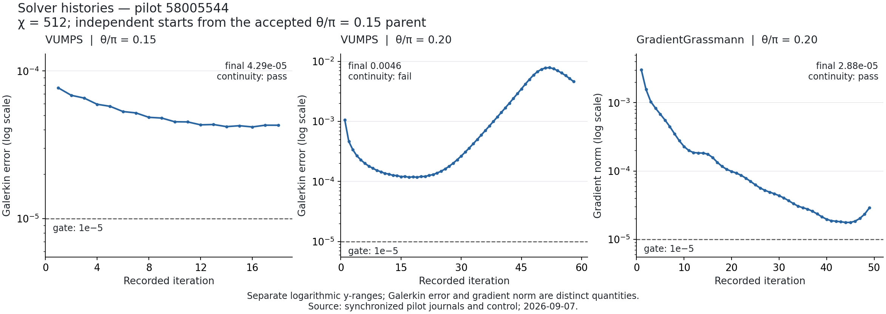

# 003 - Calibrate at fixed flux before extending the solver campaign

Status: pilot review complete; successor calibration proposed, not prepared
Date: 2026-09-07

## Recommendation

Pilot `58005544` completed successfully as a diagnostic, but produced no
numerically eligible state. GradientGrassmann preserved the declared branch
continuity at `theta/pi=0.20`; it is the most promising method tested for a
follow-up. Its late gradient increase, and the VUMPS baseline's flattening
above tolerance at the accepted `0.15` point, argue for a small fixed-flux
calibration before another flux step or chi-1024 extension.

Keep the accepted chi512 parent, all declared gates and the separate solver
error definitions. No pilot candidate is accepted, and no new experiment is
sealed or submitted by this review. The implementation and diagnostic sequence
from [decision 002](002-review-followup-diagnostics.md) is now complete.

## What the pilot established

The three stages started independently from the same SHA-pinned accepted
`theta/pi=0.15` parent, using fixed chi512, U(1), period 2 and uniform twist.
Each native convergence gate required its own error <=`1e-5`, at least four
iterations, and an energy span <=`1e-8` over the last four records.

| Stage | Final iteration | Minimum native error (iteration) | Final native error | Last-four energy span | Native gate | Continuity |
|---|---:|---:|---:|---:|---|---|
| VUMPS, 0.15 | 18 | 4.18153e-5 (16) | 4.29351e-5 | 9.15415e-9 | fail | pass |
| VUMPS, 0.20 | 58 | 1.17383e-4 (17) | 4.60009e-3 | 3.98290e-4 | fail | fail |
| GradientGrassmann, 0.20 | 49 | 1.76788e-5 (44) | 2.88487e-5 | 3.20264e-9 | fail | pass |

VUMPS reports MPSKit Galerkin error; GradientGrassmann reports its gradient
norm. Neither is interchangeable with the accepted parent's ITensor projected
residual. The equal numeric tolerances do not make the errors equivalent or
establish a cross-solver speed ranking.



The baseline reproduces the parent's observables and passes continuity, but its
native error flattens near `4.2e-5` in the observed window. Failure of this new
MPSKit gate does not retroactively invalidate the accepted ITensor state.
It does mean the baseline has not yet calibrated a production MPSKit route.

At `0.20`, VUMPS initially improves, then its error grows substantially. The
last five records decline again, but the final error is still 39.19 times the
run minimum and the energy window fails. Fits to the last 5, 10 and 20 records
give log-error slopes of `-0.1052`, `-0.04888` and `+0.08409` per iteration.
The sign depends on the window; extrapolating the final decline into a
completion forecast would be unjustified.

GradientGrassmann reaches its minimum at iteration 44, then ends 63.18% above
that minimum. The final energy window passes, but the gradient does not.
The last-five log-gradient slope is positive (`+0.1215` per iteration).
More time could help, but this history supplies no reliable convergence ETA.
Iteration 44 has a scalar record, not a saved tensor checkpoint: periodic
checkpoints are at 10, 20, 30 and 40, with the final result at 49.

## Common-representation continuity

The thresholds below are this pilot's numerical trust region. Values compare
each final candidate with the accepted parent; they are not physical phase
boundaries. All required U(1) diagnostics pass.

| Metric | Required | VUMPS 0.15 | VUMPS 0.20 | Gradient 0.20 |
|---|---:|---:|---:|---:|
| Overlap per site | >=0.99 | 0.99999985 | **0.97345930** | 0.99997046 |
| Maximum cut-entropy jump | <=0.10 | 0.00048400 | **0.81027656** | 0.00896131 |
| Local energy-term RMS jump | <=0.02 | 0.00013926 | **0.12294770** | 0.00245766 |
| Magnetization RMS jump | <=0.001 | 0.00003338 | 0.00062089 | 0.00005245 |
| Mean Schmidt total variation | <=0.05 | 0.00017262 | **0.29106704** | 0.00316431 |
| Maximum absolute log correlation-length ratio | <=0.05 | 0.00176966 | **0.08116666** | 0.01346997 |

The difficult-point VUMPS energy density is `-0.509903386736489`, compared with
GradientGrassmann's `-0.5071822728977473` at the same flux. Its lower energy
cannot override failed native and continuity gates. Its alternating energy
terms also reverse strong/weak ordering relative to the parent. These facts
do not establish a converged competing phase or a topological sector.

Cross-library energy differences are `3.89e-15`, `4.77e-15` and `8.88e-15`,
well below `1e-6`; center-relation errors are `3.26e-15`, `6.59e-12` and
`4.10e-15`, below `1e-8`. Together with the existing round-trip tests, these
checks make a gross canonical export or energy mismatch an unlikely account
of the observed solver behavior. They do not establish optimizer convergence.
Correlation lengths here use complete MPS transfer-cell units, not axial
distance. Intermediate checkpoint continuity was not measured, so the pilot
does not locate when VUMPS first departed from the declared trust region.

## The chi1024 audit strengthens the earlier warning

The owner-run scratch audit verified the returned candidate and checkpoints
52 and 60 from job `57801654`. It finds maximum per-cut entropy jumps of
`1.0086554063` for the returned iteration-52 tensor and `1.0089133947` at
iteration 60, compared with that campaign's fixed-flux bound `0.35`.
Their projected residuals are `4.8607763652e-4` and `4.9700086323e-4`, both
above its `1e-4` gate.

This replaces the earlier mean-entropy lower bound with directly audited
per-cut values. The official outcome remains numerical failure, with the
original continuity gate unevaluated. The returned candidate's manifest
retains iteration-60 metadata while its best tensor was restored from 52;
that immutable provenance is preserved. Three selected late artifacts cannot
locate an earlier transition, and overlap/correlation-length checks were not
part of this scalar scratch audit. Another long cap extension lacks both a
reliable convergence forecast and a continuity rationale.

## Runtime and reconciled cost

All six Slurm solver/analysis steps exited `0:0`. The allocation completed in
7:17:04, with 10 allocated logical CPUs and a 16G request. All stages record
`graceful_stop`, consistent with their one-/three-/three-hour soft limits;
the worker reports no pretimeout request. Successful exit means the bounded
diagnostic finished and exported its results, not that the native gates passed.

| Stage | Solver step elapsed | Analysis elapsed | Solver peak RSS (GiB) | Median last-ten iteration time (s) |
|---|---:|---:|---:|---:|
| VUMPS 0.15 | 1:03:53 | 0:04:01 | 9.422 | 188.27 |
| VUMPS 0.20 | 3:02:34 | 0:02:37 | 9.535 | 178.66 |
| Gradient 0.20 | 3:01:11 | 0:02:31 | 8.334 | 206.28 |

The analyses used 9:09 in total; other allocation overhead was 17 seconds.
The native histories report roughly 1.93-1.95 process CPU seconds per wall
second, consistent with the two Julia threads. Slurm step allocations had
four logical CPUs, but the charge uses all ten held by the allocation.
The 16G request fitted these chi512 trials; this is not a chi1024 RAM forecast.

Live reconciliation recorded at `2026-09-07T22:56:19.045` was checksum-synced
and validated locally. Pilot cost is
`26224 / 3600 * (10 / 2) / 128 = 0.2845486111111111` node-hours.
The deduplicated, actual-CPU accounting across 29 Project B allocations gives:

- Phase 1 spent: **18.046056857639 node-hours**.
- Phase 1 remaining under the 20-hour ceiling: **1.953943142361 node-hours**.
- Project B total, including estimated Phase 0: **19.140489857639 node-hours**.

The append-only corrections for the two older 18-CPU YC8 jobs are applied;
their original charge files remain intact. Unrelated `lmf1-*` jobs are excluded.
The old 32G/48h reservation would cost 3.375 node-hours and exceeds this
remaining Phase 1 balance. A new submission still needs a fresh live guard.

## Proposed next experiment

1. At fixed `theta/pi=0.15`, chi512, use the same accepted parent and unchanged
   outer gates to calibrate the native MPSKit solve. Include a GradientGrassmann
   baseline, which this pilot lacks, and diagnose the VUMPS baseline's late
   behavior with inner-solve convergence and conditioning records. Check
   explicit inner accuracy in a controlled comparison if those records
   justify it; the present evidence does not identify its cause.
2. Require native convergence and the existing common-representation checks
   before choosing a production method. If calibration passes, test the
   smaller `theta/pi=0.1625` step from the accepted parent with that method.
   The existing iDMRG midpoint control does not authorize a silent substitution
   of solver or error definition.
3. If calibration still fails, use that result to distinguish numerical
   accuracy/conditioning limits from a flux-continuation problem before
   spending on growth or a full sweep. Any separate basin experiment needs
   independent preparations and forward/reverse evidence.

This is an experiment recommendation, not a prepared launch. A successor
needs its own sealed control, measured resource forecast within the remaining
budget, tests and owner-run live preflight. No tolerance relaxation, lineage
promotion or physical spinodal claim follows from this pilot.

## Evidence and reproducibility

All paths below are relative to the Project B root. The owner confirmed the
completed sync; these artifacts establish retrospective results, not current
queue state or scratch availability.

- Run: `output/mpskit_solver_pilot_jobs/20260907T023735Z_969b69b1c40d/`.
- Control: `configs/controls/solver_pilot_control_v2.toml`, SHA-256
  `969b69b1c40d3a70e07c58fe9b12d123564781c5f40b9a4058b74f4382278818`.
- Accepted parent SHA-256:
  `38312fc996fef6ea65511eaa2fe927b2a2da634bff3dae6d6feae6b265fb7803`.
- Live accounting evidence:
  `output/accounting/evidence/bd41ae3fe55d5a1cd50a2da55122f3022fe9d5cc04030c8d895c452c022ac5b5.tsv`,
  with its matching reconciliation under `output/accounting/reconciliations/58005544/`.
- Scratch audit: `output/review_followup/checkpoint_audit_57801654_v2.toml`.
- Reproducible review: `output/review_followup/pilot_58005544_review_20260907/`,
  containing `review.json`, `accounting.txt`, `histories.csv` and PNG/SVG figures.
  The JSON records source hashes, unrounded values, individual gates and fit
  windows. The reviewed PNG is also tracked with this decision.

The [review script](../../scripts/review_solver_pilot.py) verifies all 38 sealed
source/data inputs, analysis hashes and lineage links, complete TSV/TOML
history agreement, native gates, and scratch-audit provenance. It independently
recalculates the accounting sum, entropy/energy-term/magnetization jumps and
log correlation-length changes. Schmidt variation and overlap are checked
against recorded values and thresholds; their tensor calculations are not
repeated locally. It also runs the existing Julia accounting audit and guard.
Full scratch payloads were not transferred or rehashed locally.

To reproduce locally, use Python 3.11+ with numpy, h5py and matplotlib, and a
Julia executable on PATH (or append `--julia` with its executable path). From
the Project B directory in PowerShell, choose a fresh output directory:

```powershell
python scripts/review_solver_pilot.py output/mpskit_solver_pilot_jobs/20260907T023735Z_969b69b1c40d output/review_followup/pilot_58005544_review_repeat
```

The real-artifact replay, accounting guard and all 32 accounting regression
assertions pass. The final rendered figure
was visually checked for scale labels, threshold placement and text overlap.
The context audit passes with all three active references matching. No solver
or sealed input changed, so expensive numerical optimization tests were not
repeated for this analysis.
