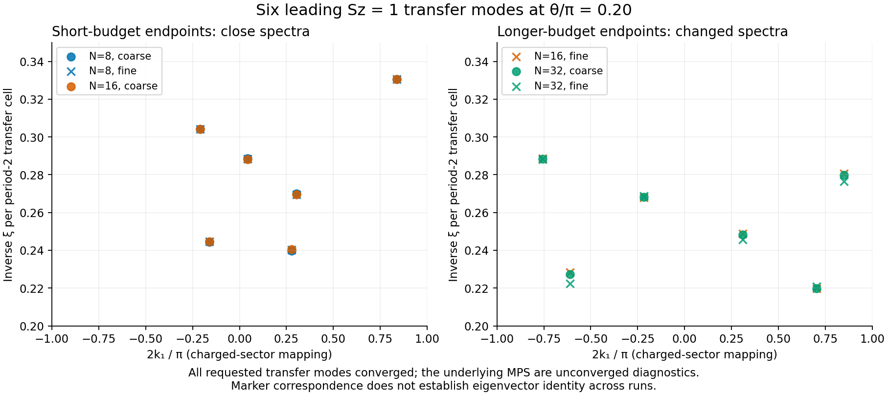
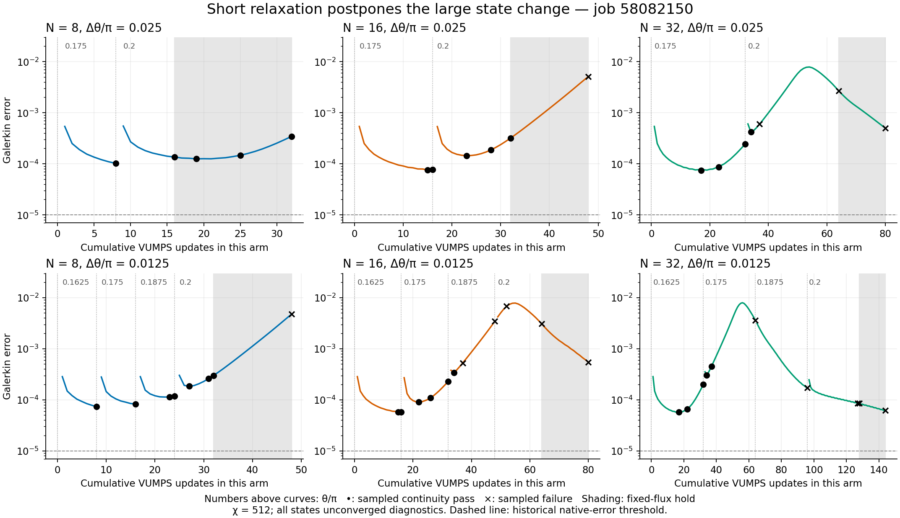
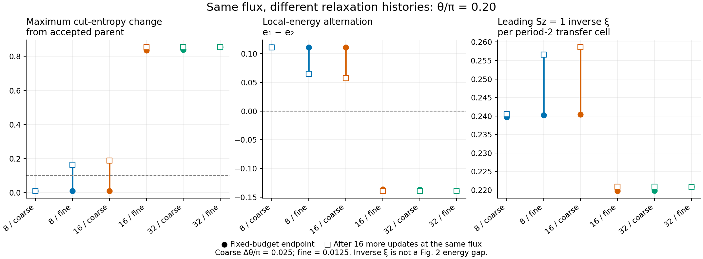

# 006 - Short relaxation preserves a reproducible transient near 0.20

Status: completed experiment reviewed; successor now implemented in [decision 007](007-test-flux-return-at-matched-relaxation.md)
Date: 2026-09-09

The bounded comparison supports the owner's proposed mechanism: substantial
state change can occur during prolonged VUMPS relaxation at unchanged flux,
after a short interval with closely agreeing spectra. It does **not** establish
a converged metastable minimum, the paper's stopping procedure, a physical
spinodal, or a reliable trajectory to pi. Keep the successful short-budget
states as diagnostic evidence; the accepted primary lineage remains at 0.15.

## Evidence and validation

Owner-confirmed completed sync:
`output/mpskit_solver_pilot_jobs/relaxation/20260908T200715Z_3e790f71089c/`.
Job **58082150** completed all seven arms, 19 flux points, **464 updates**, six
holds and **50 selected-state analyses**. No outputs are missing and no
pretimeout was requested. The sealed control SHA-256 is
`3e790f71089c87645fced05f1e7a0e7c3a49d78d5a6f5b73db19cfd0d7262fef`.
All 41 sealed source/data inputs match locally, including accepted parent
`38312fc996fef6ea65511eaa2fe927b2a2da634bff3dae6d6feae6b265fb7803`.

The independent Python review checks all iteration journals against point and
checkpoint manifests, every diagnostic seed, minimum/turnaround selection,
analysis-to-manifest hashes, native gates, scalar continuity differences,
transfer eigenvalue identities and actual-CPU accounting. Independent arms
have identical initial scalar observables and identical first-flux trajectory
prefixes through their shared update counts. The comparison is not confounded
by different initial parents.

All six requested transfer modes converge in each of Sz=0 and Sz=1 for every
analyzed state; maximum recorded spectrum Krylov residual is `8.571e-10`.
Maximum MPSKit/ITensor energy difference is `1.677e-13`, and maximum canonical
center-relation error is `6.302e-10`, below the declared `1e-8` tolerance.
**None of the 50 selected MPS passes the historical native convergence gate.**
Convergence of their transfer eigensolves is a separate fact.

Full canonical tensors were verified by the remote analysis and remain in
scratch. This local review verifies their compact hash chains, not the absent
tensor bytes or present scratch availability. First-point comparisons to the
recanonicalized imported origin cannot be independently recomputed from compact
scalar output; comparisons to the original parent, previous measured flux and
unheld endpoints can, and pass the audit. No run artifact is rewritten.

## Short-budget spectra agree

Here coarse means delta(theta/pi)=0.025 and fine means 0.0125. These are VUMPS
outer updates, not iDMRG sweeps. Every path starts independently at 0.15.

| Budget per flux | Grid | Updates to 0.20 | Parent overlap | Maximum cut-entropy change | Leading Sz=1 inverse xi | Parent continuity |
|---:|---|---:|---:|---:|---:|---|
| 8 | coarse | 16 | 0.99997521 | 0.009395 | 0.239737 | pass |
| 8 | fine | 32 | 0.99996414 | 0.009736 | 0.240194 | pass |
| 16 | coarse | 32 | 0.99996195 | 0.009712 | 0.240387 | pass |
| 16 | fine | 64 | 0.97044754 | 0.835188 | 0.219718 | fail |
| 32 | coarse | 64 | 0.96985005 | 0.839162 | 0.219808 | fail |
| 32 | fine | 128 | 0.96628920 | 0.854948 | 0.220859 | fail |

Inverse xi is per complete period-2 transfer cell. It is not a Fig. 2 energy
gap. Continuity is the existing diagnostic trust region, not a physical phase
test or a promotion decision.

At 0.20, changing from 8/coarse to 8/fine changes energy per site by
`1.1741e-6` and maximum cut entropy by `3.4100e-4`. Pairing all six charged
eigenvalues by minimum total squared complex distance gives a maximum
inverse-xi difference of `4.8465e-4` (**0.191%** relative), with maximum
transfer-phase difference `2.1435e-4` radians. Doubling 8/coarse to 16/coarse
changes the six inverse lengths by at most **0.271%**. Neutral inverse lengths
also agree closely (maximum relative differences 0.285% and 0.375%). This is
a measurable short-relaxation window, not just visual smoothness.



These are comparisons of six retained modes, not eigenvector tracking. At a
retained-mode cutoff, a different mode can enter the set; large set distances
alone cannot identify physical mode evolution. Here the large changes also
appear in energy terms, entropy and overlap.

## Total relaxation matters more than a fixed flux boundary

Holding N fixed while halving the flux step doubles the total updates. That
is not a pure discretization refinement. Equal-work comparisons are revealing:

- At **32 updates**, 8/fine and 16/coarse agree at 0.20 to `2.088e-7` in
  energy, `9.304e-5` in cut entropy and **0.0801%** in all six charged inverse
  lengths. Both pass parent continuity.
- At **64 updates**, 16/fine and 32/coarse both have changed substantially.
  Their mutual energy difference is `2.801e-5`, cut-entropy difference
  `0.003974`, and maximum matched inverse-length difference **0.498%**.
- The 32/fine path has already undergone its large change at **0.175**,
  whereas 8/coarse remains parent-continuous at **0.20**. An endpoint tied
  solely to flux cannot describe these diagnostic paths.

At 0.20, short-budget local energy alternation `e1-e2` is about **+0.111**.
Longer paths approach **-0.140**, with energy per site near **-0.51021**
instead of **-0.50718** and cut-entropy changes near **0.85**. The alternation
changes sign; the late state is not established to be uniform. This evidence
does not identify a topological sector or physical phase.

The early warning includes growing alternating local magnetization. The
8/fine and 16/coarse endpoints have maximum |Sz| about `5.84e-4` and
`6.32e-4`, rising to `9.15e-3` and `9.72e-3` after their holds. Thus excellent
initial energy/spectrum agreement does not establish that all state errors
have saturated. Some first continuity failures are magnetization or
correlation-length failures before the entropy bound is crossed.



## Holds separate flux changes from further relaxation

The endpoint hold continues the same solver at the same theta, without resetting
the iteration counter. Changes below compare the held state to its own unheld
endpoint at 0.20, rather than to the original parent.

| Arm | Extra updates | Maximum entropy change during hold | Maximum relative change of matched Sz=1 inverse xi | Continuity vs unheld endpoint |
|---|---:|---:|---:|---|
| 8/coarse | 16 | 0.000373 | 0.328% | pass |
| 8/fine | 16 | 0.153833 | 9.463% | fail |
| 16/coarse | 16 | 0.177983 | 11.023% | fail |
| 16/fine | 16 | 0.018708 | 2.656% | pass, already far from parent |
| 32/coarse | 16 | 0.014850 | 2.175% | pass, already far from parent |
| 32/fine | 16 | 0.0000578 | 0.0222% | pass, already far from parent |

The 8/coarse held state is still close after 32 total updates. The 8/fine and
16/coarse holds reach 48 total updates and fail five scalar continuity bounds,
even though overlap alone remains above 0.99. Repeated flux resets therefore
do not remove the accumulated disturbance. These sampled times are not a
universal escape clock; flux history, solver tolerances and chi can change it.

Conversely, the most-relaxed changed state has very stable hold observables.
Stability relative to an already changed state cannot recover the original
lineage. A late, small residual cannot identify the desired state either:
32/fine ends at `6.171e-5`, smaller than any short-path 0.20 endpoint, while
its overlap with the accepted parent is only 0.96627.



The unchanged-flux **0.15 baseline** also turns upward: minimum Galerkin error
`4.1815e-5` at update 16, sustained-turnaround marker at 21, and `1.6862e-4`
at 32 (4.03 times the minimum). All three sampled baseline states still pass
continuity. This directly reinforces that a turnaround is an early diagnostic
marker, not proof of branch loss or a sufficient stopping criterion.

## Interpretation and next decision

Limited relaxation is now supported as a way to preserve a reproducible
diagnostic state through the tested interval. Prolonged optimization contributes
to the apparent barrier in this implementation. We still cannot distinguish
a genuine unstable variational direction from optimizer/preparation error, or
prove that the transient belongs to a converged metastable branch. The test
does not disprove a physical spinodal elsewhere and does not explain the
authors' exact procedure. [Hu et al.](https://arxiv.org/pdf/1905.09837) uses
iDMRG and requires a separately converged infinite state for its embedded
Fig. 2 gap measurement; this VUMPS stopping test does not supply that product.

The next useful experiment is a **short onward-and-return diagnostic**, with
smaller iteration budgets and coupled budget/step refinement: for example,
4 updates per 0.025pi and 2 per 0.0125pi have equal update density, with a
second density as a control. Compare forward/reverse spectra, energy,
magnetization and local energy ordering. Choose a bounded endpoint before
preparing the control; the successor schedule and budget remain to be sealed.
Retain the original accepted parent and label any
short-budget seed explicitly diagnostic. A matched fixed-flux calibration
of the 0.15 upturn remains useful alongside that design.

Do not simply extend 8/coarse all the way to pi: that would require 272
updates from 0.15, far beyond the useful interval observed here. This count
is not a forecast of its failure point, but shows why “eight per point” is
not itself a demonstrated solution. General-chi preparation and the separate
Fig. 2 measurement in decision 004 remain necessary.

One analysis limitation must be fixed or explicitly scoped in a successor:
v1 applies the charged-sector momentum shift `2theta/Ly` to both Sz=1 and
Sz=0. The plotted Sz=1 mapping matches its intended scope. Neutral mapped
momenta are not interpreted here; their raw eigenvalues and inverse lengths
are unaffected. A charge-aware momentum mapping needs a separate tested
change and new sealed control. Preserve this completed run's pinned code.

## Resources and reproduction

Slurm records `COMPLETED`, exit `0:0`, **90685 seconds (25:11:25)**, ten
allocated logical CPUs, 16G, and fourteen successful solver/analysis steps.
Peak solver RSS is **10.315 GiB**. Charge is
`90685/3600 * 5/128 = 0.983995225694` node-hours, below the 1.40625 reservation.
Live reconciliation timestamp: `2026-09-09T21:40:03.654`; evidence SHA-256:
`6f5c0f239fce858b0c79d8fe1bfa500793afe714906a6adf9b627b714a4e1cc1`.

Thirty deduplicated Phase 1 allocations total **19.030052083333** node-hours;
remaining Phase 1 allowance is **0.969947916667**. Project total including
the Phase 0 estimate is **20.124485083333**. These are synchronized historical
balances; a future submission needs fresh live accounting. Phase allocations
are not automatically reassigned.

Reproduce locally from the Project B directory (Python dependencies: numpy,
h5py, matplotlib; use the installed Julia executable if absent from PATH):

```powershell
python scripts/review_relaxation_continuation.py `
  output/mpskit_solver_pilot_jobs/relaxation/20260908T200715Z_3e790f71089c `
  output/review_followup/relaxation_58082150_new_review --julia julia
python test/test_review_relaxation.py
```

Reviewed outputs are in
`output/review_followup/relaxation_58082150_review_20260909_v2/`: JSON with
hash provenance and matched comparisons, complete-history CSV, accounting,
and three PNG/SVG figures. Five regression tests pass; full replay passes;
altered checkpoint and analysis hash-chain fixtures are rejected. The Julia
sealed-control validator and local accounting guard also pass. Figures were
visually inspected. No Perlmutter operation was initiated locally.
