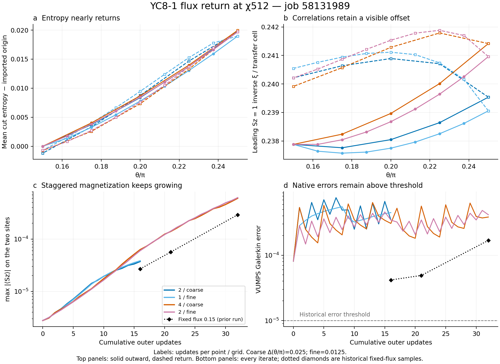

# 008 - Short flux returns preserve local observables with accumulated drift

Status: job 58131989 reconciled, synchronized and reviewed on 2026-09-10;
bounded extension proposed, not prepared or submitted. No state promotion.

The limited-relaxation path reaches theta/pi=0.25 and returns to 0.15 at chi512
with close energy, entropy and coarse/fine agreement. This strengthens the
case for short diagnostic continuation with small update budgets. Correlation
spectra retain approximately one-percent memory of the loop, and staggered
magnetization grows at every update. Adiabaticity and a stationary metastable
branch remain unestablished.



## Scope and verified completion

The owner confirmed the completed output sync. The run package is
`output/mpskit_solver_pilot_jobs/roundtrip/20260909T225809Z_40088fc17091/`.
Its control is `configs/controls/roundtrip_continuation_v1.toml`, SHA-256
`40088fc17091a0962b35de44b1f588124b8a302dbed2f8ce06769af7be64e8b7`.
The accepted parent remains theta/pi=0.15, chi512, SHA-256
`38312fc996fef6ea65511eaa2fe927b2a2da634bff3dae6d6feae6b265fb7803`.

All four independent starts completed the 0.15 -> 0.25 -> 0.15 loop:
96 VUMPS outer updates at 48 flux points and 100 analyses including four
unoptimized imported origins. These are VUMPS updates, not iDMRG sweeps.
The return carries the actual outward endpoint. Every state remains
`continuation_accepted=false`.

- All 61 pinned source/data inputs match. The existing Julia compact replay
  reproduces the remote summary exactly and verifies complete schedules,
  history/checkpoint chains, return references and native-gate applicability.
- Independent scalar checks agree with the recorded continuity decisions,
  including references to the measured imported origins. All accepted-parent,
  previous-point and same-flux forward/return comparisons pass the declared
  continuity rules for every analyzed sample.
- All six requested transfer modes converge in both Sz=0 and Sz=1 for all
  100 analyses. Eigenvalue, inverse-length and charge-aware momentum identities
  agree. Maximum cross-library energy difference is 1.7363e-12; maximum
  recorded canonical-relation/isometry error is 3.2166e-10, below 1e-8.
- Scratch tensor hashes, overlaps and Schmidt diagnostics were measured by
  the remote analysis. The local review checks their compact provenance and
  scalar consistency; it does not reload absent scratch tensors.

## Step refinement at equal update density works over this interval

| Coarse / fine updates per point | Updates per unit theta/pi | Full-loop updates per arm | Maximum coarse/fine energy difference | Maximum cut-entropy difference | Maximum matched Sz=1 inverse-xi difference |
|---|---:|---:|---:|---:|---:|
| 2 / 1 | 80 | 16 | 4.0252e-7 | 8.6062e-4 | 0.2745% |
| 4 / 2 | 160 | 32 | 1.9954e-7 | 4.1605e-4 | 0.1969% |

Maxima cover all shared forward and return fluxes. The coarse and fine flux
steps are 0.025 and 0.0125. Relative spectral differences use the first
(coarse) spectrum as denominator after a one-to-one assignment minimizing
the sum of squared complex-eigenvalue distances across the six retained modes.
The assignment is a descriptive set comparison, not eigenvector tracking.
No retained-cutoff convergence study was performed.

Doubling update density at the same grid changes the retained charged inverse
lengths by at most 0.8092% over matching endpoints. Energy differences remain
below 2.1753e-6 and cut-entropy differences below 0.001961. Local observables
and spectra are therefore fairly stable across these two budgets on this
short interval, while magnetization is substantially more sensitive.

## Local observables approximately return; correlations retain memory

The following compares each final 0.15 state to its own imported origin,
avoiding the small initial bridge-recanonicalization difference.

| Arm | Loop updates | Return overlap per site | Signed energy change | Maximum cut-entropy change | Maximum matched Sz=1 inverse-xi change | Final max abs(Sz) |
|---|---:|---:|---:|---:|---:|---:|
| 2 / coarse | 16 | 0.999998057 | +3.8370e-7 | 0.001546 | 0.9824% | 3.7223e-5 |
| 1 / fine | 16 | 0.999997614 | +6.6335e-7 | 0.001114 | 1.1209% | 3.8437e-5 |
| 4 / coarse | 32 | 0.999980524 | -1.5784e-6 | 0.001120 | 0.8554% | 6.0169e-4 |
| 2 / fine | 32 | 0.999979771 | -1.5119e-6 | 0.001086 | 0.9807% | 6.1851e-4 |

At the outward turning point, maximum cut-entropy changes from the accepted
parent are 0.02095-0.02236. Local-energy alternation decreases from about
0.11567 to 0.10714-0.10878 and returns to 0.11393-0.11415 without reversing
sign. The state measurably responds to flux; exact freezing does not explain
these curves. Close energy and entropy alone still do not prove adequate
relaxation or adiabatic following.

The charged correlation spectrum exposes the remaining history dependence.
The leading inverse correlation length starts at 0.2378788. At 0.25 it rises
by 0.6965% and 0.4948% in the two lower-density arms, but after returning to
0.15 it is still higher by 0.9824% and 1.1209%. The residual offset exceeds
the outward response in those arms. Higher-density arms rise by 1.4875% and
1.2954% outward and retain offsets of 0.8554% and 0.9807% on return.

Across every same-flux outward/return comparison, the maximum matched charged
inverse-length difference is 1.5676%, and the largest cut-entropy difference
is 0.002693. Thus the declared continuity test passes, but the spectra do not
accurately retrace the outward curve. A percent-level approximation may be
useful for exploration; this is not a demonstrated precision reproduction.
Inverse xi is per complete period-2 transfer cell, not a Figure 2 energy gap.

## The accumulating disturbance is visible in staggered magnetization

All four imported starts have max abs(Sz)=2.7661e-6. Its magnitude increases
at every one of the 96 recorded updates, including the return leg. The two
sites carry opposite signs; their summed magnetization is below 8.90e-12
throughout. This is a growing period-two staggered component, not net Sz.

The lower-density loops end at 3.72-3.84e-5, about 13.5-13.9 times the initial
amplitude. Higher-density loops end at 6.02-6.19e-4, about 218-224 times the
initial amplitude and roughly sixteen times the lower-density endpoints.
Their final magnetization changes remain below the declared 0.001 continuity
bound, but already use about 60-62% of it.

The preceding job's unchanged-flux 0.15 baseline gives a useful comparison:

| Total updates | Fixed-flux baseline max abs(Sz) | Roundtrip max abs(Sz) | Roundtrip / baseline |
|---:|---:|---:|---:|
| 16 | 2.6880e-5 | 3.7223-3.8437e-5 | 1.38-1.43 |
| 32 | 2.9173e-4 | 6.0169-6.1851e-4 | 2.06-2.12 |

Growth also occurs without changing theta. Flux history and/or repeated
environment rebuilding amplifies it further here. Those effects are not
isolated by this comparison. The evidence is consistent with amplification
of a small symmetry-breaking component under the current finite-chi solver
and preparation, but does not identify whether its origin is physical,
variational, or algorithmic. Do not infer established magnetic order or a
physical spinodal from these unconverged states.

## Native convergence and consequences for the next step

The imported-origin MPSKit Galerkin error is 8.0817e-5. Optimized samples
range from 1.4824e-4 to 7.5987e-4. None meets the 1e-5 native-error threshold.
Only eight samples have the four same-flux records required to apply the
complete native gate; all eight fail. Shorter histories remain explicitly
inapplicable. The accepted parent's historical ITensor residual is a different
quantity and is not reclassified by this comparison.

The result strengthens the operational hypothesis that few updates can carry
a smooth diagnostic path past the old convergence bottleneck. It does not
establish that the paper used this procedure, that a stationary metastable
minimum exists at every point, or that the path will remain useful to pi.
An unconverged return cannot rule out a physical spinodal.

For a next bounded range test, prefer the lower-density **2/coarse and 1/fine**
pair, independently restarted from the same accepted 0.15 parent. Extending
the turn to **0.35** would use 16 outward and 32 full-loop updates per arm,
64 total. This tests additional flux range with the update count already
explored here, while retaining step-refinement and return comparisons.
It is a proposal only: no successor is prepared or sealed, and equal update
count does not guarantee comparable drift at larger flux.

Judge that extension using spectral memory and the full magnetization history
as well as the existing continuity rules. Increasing updates solely to lower
the residual is not supported by the present tradeoff: it improves spectral
retracing slightly but substantially increases staggered magnetization.
If the disturbance grows strongly at the next interval, prioritize inspecting
the symmetry content of the preparation/solver and the general-chi growth
route over repeated longer relaxation. Any new numerical policy needs its
own controlled successor. No return endpoint replaces the accepted parent.

## Runtime, accounting and reproduction

Slurm records job 58131989 and all eight solver/analysis steps COMPLETED,
exit 0:0. Wall time is **18423 seconds (5:07:03)**, with ten allocated logical
CPUs and 16G. Solver steps total 14492 seconds (4:01:32), analysis steps total
3913 seconds (1:05:13); remaining allocation overhead is 18 seconds. Peak
solver MaxRSS is 10.4111 GiB.

Actual charge is **0.199902343750 node-hours**, compared with the 0.546875
full-limit reservation. Reconciliation at `2026-09-10T23:20:59.307` uses
evidence SHA-256
`eed1442c7ea22f74e0396b101dc6338d729f29986ff03be556739ecf6e5faa83`.
The independent actual-CPU sum agrees with the existing accounting audit:
Phase 1 spent **19.229954427083**, remaining **0.770045572917**; Project B
total **20.324387427083**, including estimated Phase 0. These are synced
retrospective balances, not a fresh live submission guard.

The review script is `scripts/review_roundtrip_continuation.py`. It reuses
the tested compact replay and prior scalar/mode-comparison helpers. It runs
no solver regression suite or optimization. Its real-data assertions and
visual inspection of the generated figure pass. Sealed runtime is unchanged.

Local PowerShell reproduction, using an available Python and Julia executable
and a new output directory:

```powershell
python -B scripts/review_roundtrip_continuation.py `
  --run output/mpskit_solver_pilot_jobs/roundtrip/20260909T225809Z_40088fc17091 `
  --out output/review_followup/roundtrip_58131989_review_replay `
  --julia julia
```

The reviewed artifact directory is
`output/review_followup/roundtrip_58131989_review_20260910/`: JSON with exact
source hashes and comparisons, endpoint CSV, replayed summary/accounting and
PNG/SVG figure. No full scratch payload transfer is needed for this review.
