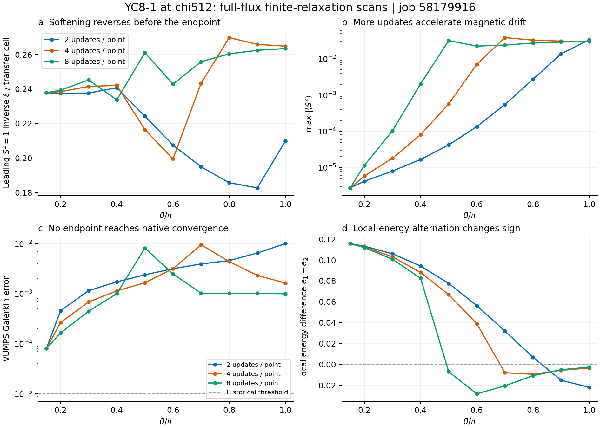
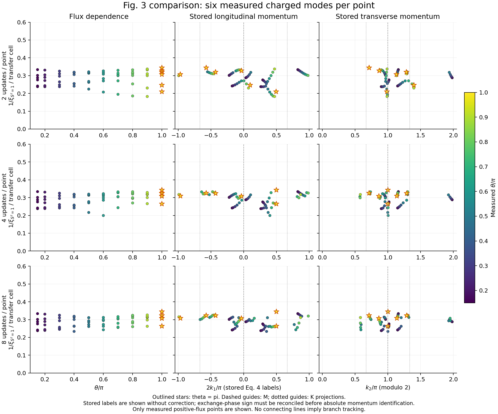

# 010 - Full-flux scans reach pi with protocol-dependent magnetic drift

Status: job 58179916 completed, reconciled, synchronized and reviewed.
Date: 2026-09-11. No state is promoted.

## Conclusion

Limited relaxation can carry the diagnostic chi512 states through theta=pi,
but these three scans do not establish a stable qualitative reproduction of
Fig. 3. The 2-update path shows useful softening before its endpoint; larger
update budgets develop appreciable staggered magnetization earlier and turn
the leading inverse correlation length upward. The 4- and 8-update endpoints
agree closely with each other, but both are magnetized and unconverged.
Their agreement is evidence of a similar late state, not of the desired branch.

The absolute momentum comparison also exposed a sign-convention issue that
the previous formula/identity checks did not resolve. Preserve the recorded
labels and raw eigenvalues. Audit the exchange-phase, transfer direction and
spin-charge convention together before assigning M/K excitations. This issue
cannot change any of the inverse lengths, energies or magnetic drift below.

## Completed experiment and evidence quality

All three arms independently import the accepted theta/pi=0.15 parent,
SHA-256 `38312fc996fef6ea65511eaa2fe927b2a2da634bff3dae6d6feae6b265fb7803`.
They evaluate 0.20, 0.30, ..., 1.00 at 2, 4 or 8 VUMPS updates per point.
There are 126 updates, 27 flux endpoints and three imported-origin analyses.
All six solver/analysis Slurm steps exit successfully. `job.result` records
`experiment_complete=true`, `step_failure=0` and no pretimeout request.

Control SHA-256:
`091d78d65226a8564927cb8627e93326311b34d5620ce073d7ea1aecb70a72e4`.
All 73 pinned source/data inputs match. The existing Julia compact replay
reproduces the remote summary exactly and validates the full checkpoint/seed
chain. Independent review confirms native-gate calculations, scalar/reference
consistency, charge and eigenvalue identities, stored momentum arithmetic,
canonical errors and actual-CPU accounting. All six requested modes converge
in both spin sectors at all 30 analyses. Maximum cross-library energy
difference is 1.913e-11; maximum canonical error is 5.748e-9, within the sealed
1e-6 and 1e-8 limits respectively. None of the states passes the native gate.

Full scratch payloads, overlaps and Schmidt spectra were measured remotely;
they were not reloaded locally. This is retrospective evidence from the
owner-confirmed sync, not a live assertion about scratch or the queue.

## Flux dependence and drift

Inverse lengths below are for physical Sz=1, per complete period-2 transfer
cell. The common imported value at theta/pi=0.15 is 0.23787880.

| Updates per point | Total updates | Lowest sampled inverse xi | Flux of minimum / pi | Inverse xi at pi | max abs Sz at pi | Galerkin at pi |
|---:|---:|---:|---:|---:|---:|---:|
| 2 | 18 | 0.182688 | 0.90 | 0.209858 | 0.033515 | 1.0122e-2 |
| 4 | 36 | 0.199453 | 0.60 | 0.264877 | 0.030540 | 1.6430e-3 |
| 8 | 72 | 0.233687 | 0.40 | 0.263512 | 0.029908 | 1.0045e-3 |

The 2-update path softens by 23.20% from its imported origin to 0.90pi, then
rebounds; its pi inverse length is only 11.78% below the origin. The 4- and
8-update pi values are 11.35% and 10.78% above the origin. Corresponding pi
correlation lengths are 4.765, 3.775 and 3.795 transfer cells.

Staggered magnetization starts near 2.77e-6. It first exceeds 0.01 in magnitude
at sampled fluxes 0.90, 0.70 and 0.50pi for 2, 4 and 8 updates respectively.
This 0.01 marker is descriptive, not a declared phase boundary or acceptance
threshold. Final values near +/-0.03 on the two sites preserve zero total Sz
but show a pronounced staggered moment. Local-energy alternation changes sign
around the same rapid changes. This is consistent with accumulated relaxation
amplifying a magnetic disturbance; the runs do not isolate whether the cause
is finite chi, preparation, the optimizer, or a physical instability.

All arms first fail the accepted-parent continuity policy at 0.40pi. For n2
and n4 the first cause is the log-correlation-length bound; n8 also exceeds
the magnetization-jump bound. These are numerical trust-region failures,
not a measured spinodal. The n4/n8 final steps pass previous-point continuity
again, after the large changes have occurred. Local smoothness at the end
does not repair continuity to the original state.

At pi, n4/n8 energies differ by 1.0771e-5 per site; the leading inverse lengths
agree within 0.516%, and all six complex-eigenvalue-matched inverse lengths
within 0.670%. By contrast n2 differs from their leading inverse lengths by
25.6-26.2%. Mode assignment here minimizes complex-eigenvalue distance and
does not establish eigenvector identities, especially across mode entry/exit
from the six-mode cutoff.



## Comparison with Fig. 3 and the momentum caveat

The relevant reference is [Hu et al. Fig. 3(c), with the transfer definition
and Eq. (4) in the supplement](https://arxiv.org/pdf/1905.09837). It uses
m=12288 for YC8-1 and shows a soft M branch plus K-associated modes. Its
momentum targets are (2k1,k2)=(0,pi) and (+/-2pi/3,+/-2pi/3). The smallest
repeating transfer cell has two sites, so use the recorded -log(abs(lambda))
without fitting a vertical rescaling. The finite-m endpoint is not expected
to be exactly gapless.

Our 2-update result has partial resemblance: a softening charged mode and
low inverse lengths near transverse momentum k2=pi. The strong dependence
on update budget, earlier upturns and magnetic drift prevent claiming the
paper's stable M/K structure. Only six modes are measured, and only positive
flux 0.15..1 is sampled; missing higher modes or the other half of a cone
must not be interpreted as absent physical excitations.

There is an additional convention problem. In `src/Observables.jl` and
`idmrg/src/ProjectBIDMRG.jl`, an oriented bond carries
`exp(+i*theta*drow/Ly) S+_source S-_target + h.c.`. Fig. S2 instead states
that this positive phase multiplies `S-_source S+_target`. At fixed oriented
coordinates the Hamiltonians therefore identify theta_paper=-theta_code.
The saved Eq. (4) formula nevertheless uses `2k1=k+2*theta_code/Ly`.
It needs a joint calibration with the library's transfer direction and charge
orientation, not merely a test that the same formula was evaluated correctly.

For example, the leading pi modes are recorded near
`(2k1/pi,k2/pi)=(0.50,1.00)`. Substituting theta_paper=-theta_code in Eq. (4)
moves these same modes to about `(0,1)`: longitudinal values -0.003834,
-0.0000775 and -0.0001928 for n2/n4/n8. This is a convention-sensitivity
calculation, not a silently validated correction or a new measurement.
Consequently do not claim that M is absent based on the saved 0.5pi location,
and do not identify K branches from these labels yet. A sign or charge
relabeling leaves all inverse lengths and the preceding conclusions intact.



## Accounting

Job 58179916 completed in 26068 seconds (7:14:28), using ten allocated logical
CPUs and 16G. Solver steps took 4372/7336/12961 seconds for n2/n4/n8;
their analyses took 467/457/451 seconds. Maximum solver RSS was 10.295 GiB.
The actual charge is **0.282855902778 node-hours**, well within the 1.875-hour
reservation. Updated Phase 1 spend is **19.512810329861**, leaving
**50.487189670139**; project spend including estimated Phase 0 is
**20.607243329861**.

Reconciliation timestamp: `2026-09-11T18:54:28.682`.
Evidence SHA-256:
`358e508cd27c30407b4df9ed61d4d733244d1d8e7b68a132ef6f19a71ccd4daa`.
Budget and scheduler time did not limit this trial.

## Decision and next priority

Preserve the three paths as useful diagnostics, with no accepted-lineage
promotion. Do not interpret reaching pi as reproducing the paper, or n4/n8
agreement as convergence to its spin-liquid branch. Do not launch more
updates-per-point combinations simply to lower residuals.

First resolve the signed momentum convention with a small independent
operator/transfer calibration, retaining the old recorded labels. Then
prioritize a separately labeled zero-flux preparation and general-chi growth
path over more prolonged chi512 relaxation. A finite 1/xi at chi512 by itself
is not failure; the central obstacles shown here are protocol dependence and
the developing staggered moment. Fig. 2 remains a separate measurement task.

## Reproduction and artifacts

Run package:
`output/mpskit_solver_pilot_jobs/fullflux/20260911T003702Z_091d78d65226/`.
Review artifacts:
`output/review_followup/fullflux_58179916_review_20260911/`.
The latter contains `review.json`, `finals.csv`, exact compact/accounting
replays and PNG/SVG plots. The JSON includes source hashes and all scalar,
spectrum and pairwise comparisons. No new numerical optimization ran locally.

Local PowerShell reproduction, using a new output directory:

```powershell
& 'C:/Python313/python.exe' -B scripts/review_fullflux_continuation.py `
  --run output/mpskit_solver_pilot_jobs/fullflux/20260911T003702Z_091d78d65226 `
  --out output/review_followup/fullflux_58179916_review_new `
  --julia 'C:/Users/Kevin/.julia/juliaup/julia-1.12.7+0.x64.w64.mingw32/bin/julia.exe'
```
